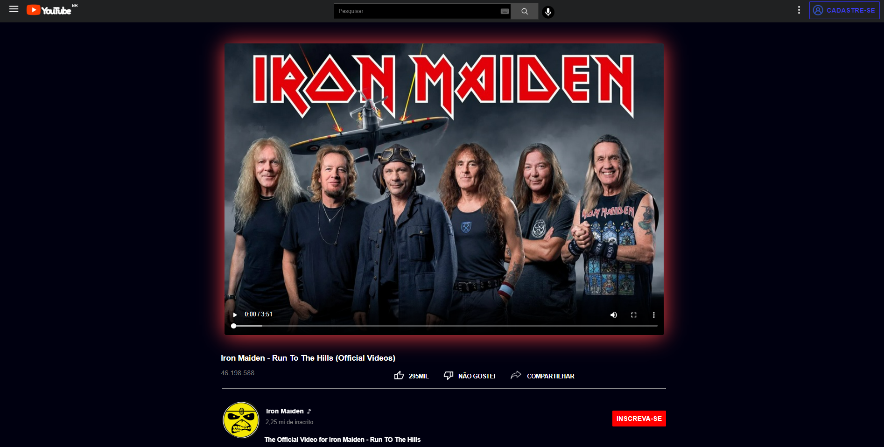

><h1>Interface do YouTube</h1>

<h2 align="center">
  Acesse a Interface do YouTube Clicando <a target="_blank" href="https://erick-sarges.github.io/I-Tube/">AQUI</a>!
</h2>

<h3 align="center">Versão Mobile</h3>

> <i align="center"> Melhor responsividade para </i> <b> Iphone XR, SE e 12PRO.</b>

  <b>Sobre o Projeto | Tecnologias</b>

## :clipboard: Sobre o Projeto
Esse projeto é uma cópia minimalista do YouTube.
Através dela você consegue pesquisar qualquer vídeo que tenha na plaforma original.
## :computer: Tecnologias utilizadas
O projeto foi desenvolvido utilizando as seguintes tecnologias:
- <b>HTML</b>
- <b>CSS</b>